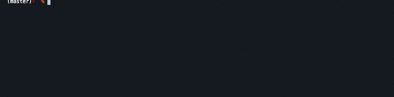
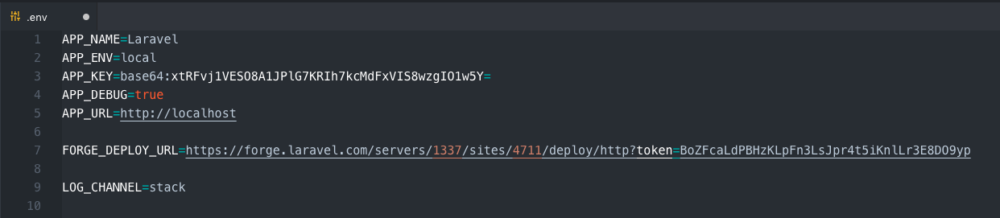

# Laravel Artisan Forge Deploy

[](LICENSE.md)


This will give you the power to deploy your Laravel project on your configured Forge server site with this needful artisan command. This package requires PHP 7 and Laravel 5.7 or higher.

``` bash
php artisan forge:deploy
```



## Installation

Pull this package in using composer:

Use the 2.0 Branch for Laravel 7 or 8

```bash
composer require --dev tobischulz/artisan-forge-deploy "^2.0"
```

Use 1.0 Branch for Laravel 5.7 or above

```bash
composer require --dev tobischulz/artisan-forge-deploy "^1.0"
```

Next, add the Key **FORGE_DEPLOY_URL** to your .env file.

```env
FORGE_DEPLOY_URL=
```



You´re ready to go to fire `php artisan forge:deploy` on cli now.


## Credits

- [Tobias Schulz](https://github.com/tobischulz)

## License

The MIT License (MIT). Please see [License File](LICENSE.md) for more information.
